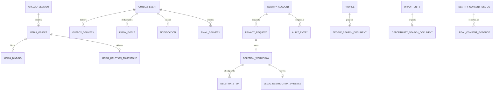

# Модель данных MVP

Статус: целевая логическая и физическая модель для реализации.
Дата: 19.08.2026.

Документ развивает принятый `docs/architecture/system-design.md` и ADR-002, ADR-004, ADR-005, ADR-007, ADR-011 и ADR-012. Он задаёт обязательные таблицы, типы, ограничения и access paths. Prisma schema и SQL migrations могут уточнять имена служебных полей, но не могут ослаблять описанные инварианты без изменения этого документа и, для архитектурно значимых решений, соответствующего ADR.

## 1. Общие соглашения

- Основное хранилище — PostgreSQL. Каждый bounded context владеет одноимённой schema и своими migrations. Код не читает чужую schema напрямую; межмодульная ссылка вида `*_id` проверяется через публичный contract. FK внутри owning schema обязателен; cross-schema FK допустим только для явно согласованного стабильного ID и не разрешает runtime-коду читать чужие таблицы. В остальных случаях ниже явно написано `logical ref`.
- Идентификаторы — UUIDv7 (`uuid`), создаваемые приложением. Все моменты времени — `timestamptz` в UTC; календарный день — `date`; пользовательский часовой пояс — IANA ID в `varchar(64)`.
- Состояния реализуются PostgreSQL enum либо `text` с `CHECK`; перечни в документе закрыты для текущей major schema version.
- У каждой изменяемой aggregate/root-таблицы есть `created_at`, `updated_at` и `row_version bigint NOT NULL DEFAULT 0`. `row_version` увеличивается каждым semantic update и используется для optimistic compare-and-set. Неизменяемые facts/events имеют только время создания.
- Каждый PK создаёт B-tree index. Его общий query pattern — точечное чтение, update или delete по публичному resource ID. Ниже перечислены остальные индексы и UNIQUE indexes; отдельный дублирующий индекс на те же начальные колонки не создаётся.
- Публичный контент версионируется. Root хранит `published_version_id` и не более одного `pending_version_id`; version row после отправки на проверку неизменяема. Пока новая версия проверяется, читается последняя одобренная.
- `deleted_at` используется только как краткоживущий tombstone для restartable deletion или удаления объекта из S3. Это не способ бессрочно хранить пользовательские данные.
- Значение `required` означает `NOT NULL`; `optional` — nullable. Поля, обязательные только в конкретном state, защищаются составным `CHECK`.
- В компактных описаниях один тип после группы имён относится ко всей группе: например, `created_at, updated_at timestamptz` означает два `timestamptz`. Если тип не повторён, суффиксы нормативны: `*_id` — `uuid`, `*_at` — `timestamptz`; все поля required, если явно не написано `optional`.

### 1.1 Общий lifecycle публичной версии

`draft -> moderation_pending -> approved | rejected`; ранее опубликованная версия после переключения указателя становится `superseded`. После ручного возврата root получает `revision_required`; исправление идёт в `manual_review_pending`. На время открытой апелляции root имеет `edit_locked = true`. Каждая version table имеет `UNIQUE (root_id, version_no)` и partial `UNIQUE (root_id) WHERE state IN ('moderation_pending','manual_review_pending')`: одновременно проверяется не более одной версии агрегата. Публикация разрешена только если текстовый `trust.moderation_request` и все связанные public media имеют решение `approved` для той же версии.

### 1.2 Классы хранения

| Класс | Правило |
|---|---|
| Active user data | Пока существует owning object и аккаунт; при запросе удаления сразу скрывается, после 7 суток удаление необратимо, полное уничтожение, включая backups, — не позднее 30 суток от исходного запроса. |
| Ephemeral workflow | До завершения workflow и короткого окна безопасного replay; конкретный срок указан у таблицы. |
| Audit in main DB | До hard delete соответствующего пользователя/объекта, но не переносится в legal evidence. |
| Legal evidence | Только минимальные доказательства согласия/отзыва/уничтожения, в отдельной БД, без контента и внешних FK, максимум 3 года. |
| Backup | Пользовательский контур — максимум 21 день; backup не используется как moderation archive. |

## 2. ER diagrams

Диаграмма разделена на предметную и инфраструктурную части, чтобы Mermaid оставался читаемым. Межмодульные ссылки показаны как логические связи; они не означают разрешение на cross-schema SQL.

```mermaid
erDiagram
    IDENTITY_ACCOUNT ||--|| IDENTITY_CREDENTIAL : authenticates_with
    IDENTITY_ACCOUNT ||--o{ IDENTITY_SESSION : opens
    IDENTITY_ACCOUNT ||--o{ IDENTITY_TOKEN : receives
    IDENTITY_ACCOUNT ||--o{ IDENTITY_CONSENT_STATUS : has
    IDENTITY_ACCOUNT ||--o{ IDENTITY_PERMISSION_GRANT : has
    CATALOG_VERSION ||--o{ CATALOG_TAG : contains
    IDENTITY_ACCOUNT ||--|| PROFILE : owns
    PROFILE ||--o{ PROFILE_VERSION : versions
    PROFILE ||--o{ RESUME : contains
    RESUME ||--o{ RESUME_VERSION : versions
    RESUME_VERSION ||--o{ RESUME_PROJECT : contains
    RESUME_VERSION ||--o{ RESUME_VERSION_TAG : tagged
    CATALOG_TAG ||--o{ RESUME_VERSION_TAG : referenced_by
    IDENTITY_ACCOUNT ||--o{ ACTIVITY_DAY : records
    IDENTITY_ACCOUNT ||--o{ OPPORTUNITY : authors
    TEAM ||--o{ OPPORTUNITY : authors
    OPPORTUNITY ||--o{ OPPORTUNITY_VERSION : versions
    OPPORTUNITY_VERSION ||--o{ OPPORTUNITY_VERSION_TAG : tagged
    OPPORTUNITY ||--o{ OPPORTUNITY_VIEW_DAY : viewed
    OPPORTUNITY ||--o{ APPLICATION : receives
    IDENTITY_ACCOUNT ||--o{ APPLICATION : submits
    APPLICATION ||--|| RESUME_SNAPSHOT : freezes
    OPPORTUNITY ||--o{ APPLICATION_FACT : contributes
    IDENTITY_ACCOUNT ||--o{ TEAM : leads
    TEAM ||--o{ TEAM_VERSION : versions
    TEAM_VERSION ||--o{ TEAM_PROJECT : contains
    TEAM_VERSION ||--o{ TEAM_VERSION_TAG : tagged
    TEAM ||--o{ TEAM_MEMBERSHIP : has
    TEAM ||--o{ TEAM_JOIN_REQUEST : receives
    TEAM ||--o{ TEAM_INVITATION : sends
    TEAM ||--o{ TEAM_SUBSCRIPTION : followed_by
    TEAM ||--o{ TEAM_BLOCK : blocks
    TEAM ||--o{ TEAM_EVENT : owns
    TEAM_EVENT ||--o{ TEAM_EVENT_VERSION : versions
    TEAM_EVENT_VERSION ||--o{ TEAM_EVENT_VERSION_TAG : tagged
    CONVERSATION ||--o{ CONVERSATION_PARTICIPANT : authorizes
    CONVERSATION ||--o{ MESSAGE : contains
    MESSAGE ||--o{ MESSAGE_ATTACHMENT : attaches
    MESSAGE ||--o{ REPORTED_REVISION : snapshots
    TRUST_REPORT ||--o| REPORT_EVIDENCE : has
    REPORT_EVIDENCE ||--o{ REPORT_EVIDENCE_ITEM : references
    TRUST_REPORT ||--o| MODERATION_DECISION : produces
    MODERATION_REQUEST ||--o| MODERATION_DECISION : produces
    MANUAL_REVIEW ||--o| MODERATION_DECISION : produces
    MODERATION_DECISION ||--o| APPEAL : appealed_by
```

## 3. Identity (`identity`)

### 3.1 `identity.accounts`

Purpose: source of truth для входа, формальной роли и account lifecycle. Ownership: `Identity`.

| Field | Type | R/O | Meaning |
|---|---|---:|---|
| `id` | `uuid` | required | PK. |
| `email_normalized` | `varchar(320)` | required | Lowercase/Unicode-normalized email; наружу не публикуется. |
| `formal_role` | enum `student, teacher, employer` | required | Не является system permission. |
| `system_role` | enum `user, moderator` | required | Default `user`; moderator не выводится из формальной роли. |
| `state` | enum `unverified, active, deleting, deleted` | required | Server-side access guard. |
| `email_verified_at` | `timestamptz` | optional | Обязателен в `active`. |
| `deletion_requested_at`, `deletion_irreversible_at` | `timestamptz` | optional | Обязательны в `deleting`; второй момент равен первому + 7 суток. |
| `last_login_at` | `timestamptz` | optional | Для снятия личных объявлений после 2 месяцев без входа. |
| common mutable fields | see §1 | required | `created_at`, `updated_at`, `row_version`. |

Relationships: 1:1 credential/profile, 1:N sessions/tokens/consents/grants. Cross-module account IDs не имеют FK. Constraints: UNIQUE email; `student|teacher` требуют домен `mpei.ru`; state/time consistency; `deleted` row содержит только технический tombstone до завершения workflow, затем hard delete. Lifecycle: `unverified -> active -> deleting -> active` до irreversible point либо `deleting -> deleted -> hard delete`. Retention: active user data; tombstone удаляется в пределах 30 суток.

Indexes/query patterns:

- `UNIQUE (email_normalized)` — login, registration duplicate check и password reset lookup.
- `(last_login_at, id) WHERE state = 'active'` — maintenance batch находит авторов, не входивших два месяца.

### 3.2 `identity.credentials`

Purpose: локальный password credential; ownership `Identity`. Fields: `account_id uuid` required PK/FK accounts; `password_hash text` required; `argon2_parameters jsonb` required с версией алгоритма/параметров; `password_changed_at timestamptz` required; `created_at`, `updated_at` required. Constraint: ровно одна запись на account; hash никогда не логируется. Lifecycle: create, atomic replace after verified reset, cascade hard delete. Retention: с аккаунтом. Index: только PK `(account_id)` — credential lookup после account/session authorization.

### 3.3 `identity.auth_tokens`

Purpose: одноразовые email verification/password reset tokens; `Identity`. Fields: `id uuid` required PK; `account_id uuid` required FK; `purpose enum(email_verification,password_reset)` required; `token_hash bytea` required; `expires_at timestamptz` required; `consumed_at timestamptz` optional; `created_at timestamptz` required. Constraint: raw token не хранится; conditional update `consumed_at IS NULL AND expires_at > now()` обеспечивает one-time use. Lifecycle: issued -> consumed|expired -> hard delete. Retention: terminal rows максимум 24 часа.

Indexes: `UNIQUE (token_hash)` — lookup предъявленного token без account enumeration; `(expires_at,id) WHERE consumed_at IS NULL` — expiry cleanup; `(account_id,purpose,created_at DESC)` — отзыв прежних tokens при повторной выдаче.

### 3.4 `identity.sessions`

Purpose: отзываемые opaque sessions; `Identity`. Fields: `id uuid` required PK; `session_hash bytea` required; `account_id uuid` required FK; `csrf_secret_hash bytea` required; `expires_at timestamptz` required; `revoked_at timestamptz` optional; `last_seen_at`, `created_at` required. Raw secrets отсутствуют. Lifecycle: active -> revoked|expired -> hard delete. Retention: до 30 суток после terminal state, немедленно при account hard delete.

Indexes: `UNIQUE (session_hash)` — auth lookup; `(account_id,created_at DESC) WHERE revoked_at IS NULL` — revoke-all и socket disconnect; `(expires_at,id) WHERE revoked_at IS NULL` — expiry sweep.

### 3.5 `identity.consent_statuses`

Purpose: актуальный guard обязательных согласий в основной БД; доказательная запись находится в legal DB. Fields: `account_id uuid` required FK; `document_type enum(age_18,user_terms,personal_data,public_profile_distribution)` required; `document_version varchar(64)` required; `accepted_at`, `revoked_at timestamptz` optional; `source_event_id uuid`, `updated_at timestamptz` required. PK `(account_id,document_type)`. Active consent требует accepted/non-revoked; активация проверяет все четыре типа в основной транзакции; outbox переносит proof в legal DB. Lifecycle: upsert current status. Retention: с аккаунтом. Index: только PK — guard всегда читает набор одного account.

### 3.6 `identity.permission_grants`

Purpose: текущие узкие moderator permissions; `Identity`. Fields: `account_id uuid` required FK; `permission_code enum(reports.review,appeals.review,evidence.view,moderation.escalated_review)` required; `granted_by uuid`, `granted_at timestamptz` required; `revoked_by uuid`, `revoked_at timestamptz` optional; `updated_at` required. PK `(account_id,permission_code)`. Permission действует при `revoked_at IS NULL`; grant разрешён только аккаунту с `system_role='moderator'`, а каждое изменение аудируется. Lifecycle: grant -> revoke -> possible re-grant. Retention: до hard delete account.

Indexes: PK — authorization lookup/deduplication; `(permission_code,account_id) WHERE revoked_at IS NULL` — административный список обладателей права.

## 4. Catalog (`catalog`)

### 4.1 `catalog.versions`

Purpose: product-managed версии справочника; `Catalog`. Fields: `id uuid` required PK; `version varchar(32)` required; `state enum(draft,active,retired)` required; `published_at timestamptz` optional; `created_at` required. Constraints: UNIQUE version; одна active версия. Lifecycle: draft -> active -> retired, immutable after activation. Retention: постоянно.

Indexes: `UNIQUE (version)` — deploy/import lookup; `UNIQUE ((state)) WHERE state='active'` — ровно одна active version и её точечная выдача.

### 4.2 `catalog.tags`

Purpose: канонические tags; `Catalog`. Fields: `id uuid` required PK; `catalog_version_id uuid` required FK; `code varchar(80)`, `name varchar(120)`, `category varchar(120)` required; `sort_order smallint`, `created_at` required. Пользовательские inserts запрещены; 180-row count проверяет release validation. Lifecycle immutable, retention permanent.

Indexes: `UNIQUE (catalog_version_id,code)` — payload validation/resolve ID; `UNIQUE (catalog_version_id,sort_order)` — стабильная упорядоченная выдача, поэтому отдельный version index не нужен.

## 5. Profiles (`profiles`)

### 5.1 `profiles.profiles`

Purpose: profile aggregate/publication pointers and private display/activity preference; `Profiles`. Fields: `id uuid` required PK; `account_id uuid` required logical ref UNIQUE; `formal_role enum(student,teacher,employer)` required immutable copy; `timezone varchar(64)` required default `Europe/Moscow`; `publication_state enum(draft,pending,published,revision_required,hidden,deleting)` required; `published_version_id`, `pending_version_id uuid` optional FK; `edit_locked boolean` required; common mutable fields. Constraints: one profile/account; valid IANA timezone; role copy создаётся atomically with Identity and never changes; pointers differ and belong to root; visibility also requires active account/consent. Lifecycle: draft -> moderated published; hidden immediately on deletion. Retention: with account.

Index: `UNIQUE (account_id)` — own/current profile lookup and cascade. Search uses projection, поэтому OLTP FIO/filter indexes отсутствуют.

### 5.2 `profiles.profile_versions`

Purpose: immutable moderated profile payload; `Profiles`. Fields: `id uuid` required PK; `profile_id uuid` required FK; `version_no integer`, public-version `state` required; `full_name varchar(200)`, `specialization varchar(200)` required; `institute varchar(200)`, `course smallint`, `department varchar(200)`, `company varchar(200)`, `position varchar(200)`, `avatar_media_id uuid` optional; `submitted_at`, `decided_at` optional; `created_at` required. Role-shaped CHECK requires institute/course 1..6 for student, department for teacher, company for employer, and nulls role-irrelevant fields. Immutable after draft. Lifecycle common public-version; retention with profile.

Index: `UNIQUE (profile_id,version_no)` — ordered version creation/ownership. Root pointers serve current lookup.

### 5.3 `profiles.resumes`

Purpose: primary/additional resume aggregate and visibility; `Profiles`. Fields: `id uuid` required PK; `profile_id uuid` required FK; `slot smallint` required 0..5; `is_search_visible boolean` required; `publication_state` required; `published_version_id`, `pending_version_id uuid` optional FK; `edit_locked boolean` required; common mutable fields. Constraint: UNIQUE profile/slot; slot 0 primary and always visible; slots 1..5 implement five-additional limit. Lifecycle versioned; additional can hide without delete. Retention with profile; Recruitment snapshot independent.

Index: `UNIQUE (profile_id,slot)` — list/order/limit and primary lookup. Visibility index is unnecessary for at most six rows.

### 5.4 `profiles.resume_versions`

Purpose: immutable moderated resume text; `Profiles`. Fields: `id uuid` required PK; `resume_id uuid` required FK; `version_no integer`, public-version `state` required; `about varchar(1024)` required; `image_media_id uuid` optional Files ref; moderation timestamps optional; `created_at` required. Immutable after draft; optional image must be approved `public_content`. Lifecycle common; retention with resume. Index `UNIQUE (resume_id,version_no)` — sequencing/ownership.

### 5.5 `profiles.resume_projects`

Purpose: ordered projects inside resume version; `Profiles`. Fields: `resume_version_id uuid` required FK; `position smallint` required; `title varchar(200)`, `description varchar(2000)` required; `url varchar(2048)` optional. PK `(resume_version_id,position)`; position 1..10 enforces max 10; parent mutability rule applies. Retention with version. Only PK index — ordered load.

### 5.6 `profiles.resume_version_tags`

Purpose: tag membership; fields `resume_version_id uuid`, `tag_id uuid` required; PK both. Maximum 20 enforced under parent row lock; tag checked through Catalog contract. Retention with version. Only PK — load/deduplicate; reverse tag lookup uses Search.

### 5.7 `profiles.activity_days`

Purpose: one fact per active calendar day for FR-035; `Profiles`. Fields: `account_id uuid`, `activity_date date`, `last_action_at timestamptz` required; PK first two. `activity_date` фиксируется по profile timezone в момент действия; upsert with `GREATEST` is idempotent. Retention rolling 31 days and account cascade.

Indexes: PK — record/count one user's last 30 days; `(activity_date,account_id)` — nightly expiry and incremental aggregate removal.

## 6. Opportunities (`opportunities`)

### 6.1 `opportunities.opportunities`

Purpose: personal/team opportunity aggregate, ownership and publication pointers; `Opportunities`. Fields: `id uuid` required PK; `author_kind enum(account,team)`, `author_id uuid` required; `state enum(draft,pending,published,inactive,revision_required,deleting)` required; `published_version_id`, `pending_version_id uuid` optional FK; `edit_locked boolean` required; `published_at`, `inactivated_at` optional; common mutable fields. Constraints: author exists/owns command; self/team members cannot apply or contribute popularity; one pending version; inactive/deleting not searchable. Lifecycle: draft -> pending -> published -> inactive|deleting; edit leaves last approved visible. Retention until explicit/author/team/account deletion, then hard delete.

Indexes: `(author_kind,author_id,state,created_at DESC,id DESC)` — author's management list/cascade; `(state,inactivated_at,id) WHERE state IN ('inactive','deleting')` — bounded cleanup/reconciliation. Catalog reads use Search.

### 6.2 `opportunities.opportunity_versions`

Purpose: immutable moderated body; `Opportunities`. Fields: `id uuid` required PK; `opportunity_id uuid` required FK; `version_no integer`, public-version `state` required; `type_code` required enum of 23 product values; `custom_type_name varchar(80)` optional; `title varchar(200)`, `description varchar(5000)`, `contact varchar(500)` required; `cover_media_id uuid` required Files ref; moderation timestamps optional; `created_at` required. Custom name exists only for `other`; media must be approved public content. Lifecycle common; retention with opportunity.

Index: `UNIQUE (opportunity_id,version_no)` — sequencing/ownership. Root pointers replace state index.

### 6.3 `opportunities.opportunity_version_tags`

Purpose: version tags. Fields `opportunity_version_id uuid`, `tag_id uuid` required; composite PK; max 10 under locked parent; Catalog contract validates ID. Retention with version. Only PK — ordered ownership/dedup; tag search is projected.

### 6.4 `opportunities.opportunity_view_days`

Purpose: exact rolling unique-view facts; `Opportunities`. Fields: `opportunity_id uuid`, `viewer_account_id uuid`, `view_date date`, `viewed_at timestamptz` required; PK first three. Owner/team-member facts are rejected; duplicate same-day view is no-op. Retention rolling 31 days, earlier with opportunity/account.

Indexes: PK — deduplicate/test viewer in 30-day window; `(view_date,opportunity_id,viewer_account_id)` — expiry and re-evaluation when a day leaves the window.

## 7. Recruitment (`recruitment`)

### 7.1 `recruitment.applications`

Purpose: единственный текущий business record отклика; `Recruitment`. Fields: `id uuid` required PK; `opportunity_id`, `candidate_account_id`, `recipient_id uuid` required; `recipient_kind enum(account,team)` required; `resume_snapshot_id uuid` required FK UNIQUE; `status enum(pending,accepted,rejected)` required; `eligible_again_at`, `decided_at timestamptz`, `decided_by uuid` optional; `conversation_status enum(not_requested,pending,ready,failed)` required; `conversation_id uuid` optional; common mutable fields.

Constraints: UNIQUE `(opportunity_id,candidate_account_id)`; no self/team-member application; retry only at eligibility time, never after accepted; decision CAS from pending and irreversible. Reapply deletes old row/snapshot and inserts new pair in one transaction under business-key lock. Lifecycle pending -> accepted|rejected; pending/rejected can be replaced after 3 days; accepted remains until opportunity/account deletion. Rejected row is removed after cooldown and successful notification if no replacement is needed; no permanent history UI.

Indexes: UNIQUE business key — dedup/replacement/post-accept prohibition; `(recipient_kind,recipient_id,status,created_at DESC,id DESC) WHERE status='pending'` — review inbox; `(candidate_account_id,created_at DESC,id DESC)` — result lookup/account deletion; `(status,eligible_again_at,id) WHERE status='rejected'` — retention cleanup.

### 7.2 `recruitment.resume_snapshots`

Purpose: immutable chosen resume; `Recruitment`. Fields: `id uuid` required PK; `source_resume_id`, `source_resume_version_id uuid` required; `schema_version smallint` required; `payload jsonb` required; `captured_at timestamptz` required. Payload validates versioned schema and excludes private fields. Exactly one application points to it. Retention with application; delete on replacement/cascade. Only PK index because lookup uses snapshot ID from application.

### 7.3 `recruitment.application_facts`

Purpose: rolling unique-applicant popularity fact independent of short-lived applications. Fields: `opportunity_id uuid`, `candidate_account_id uuid`, `application_date date`, `applied_at timestamptz` required; PK first three. Same candidate/day once; owner/team members absent. Retention rolling 31 days and subject/opportunity cascade.

Indexes: PK — dedup/window check; `(application_date,opportunity_id,candidate_account_id)` — expire leaving-day facts and maintain aggregate.

## 8. Teams (`teams`)

### 8.1 `teams.teams`

Purpose: team aggregate, immutable leader and publication pointers; `Teams`. Fields: `id uuid` required PK; `leader_account_id uuid` required; `state enum(draft,pending,active,revision_required,deleting)` required; `published_version_id`, `pending_version_id uuid` optional FK; `edit_locked boolean` required; common mutable fields. Constraints: no transfer; leader is not an ordinary member and cannot leave/remove self; only leader manages. Lifecycle create -> moderated active -> deleting; deletion hides then cascades. Retention until team/leader deletion.

Index: `(leader_account_id,state,created_at DESC,id)` — own teams, authorization and leader cascade. No team-name index: team search is not required.

### 8.2 `teams.team_versions`, `teams.team_projects`, `teams.team_version_tags`

Purpose: immutable moderated team profile and children; `Teams`.

- `team_versions`: `id uuid` PK, `team_id uuid` FK, `version_no integer`, public-version `state`, `name varchar(200)`, `about varchar(3000)`, `avatar_media_id uuid` optional, moderation timestamps optional, `created_at`; other fields required. UNIQUE `(team_id,version_no)`, common lifecycle, retention with team.
- `team_projects`: `team_version_id uuid`, `position smallint`, `title varchar(200)`, `description varchar(2000)` required, `url varchar(2048)` optional; PK version/position. Product sets no count maximum, so only positive position and payload-size guard apply.
- `team_version_tags`: `team_version_id uuid`, `tag_id uuid` required; composite PK; Catalog logical ref.

Indexes: version UNIQUE sequences versions; child PKs load ordered children/deduplicate tags. Reverse name/tag indexes are absent because no team-search query exists.

### 8.3 `teams.memberships`

Purpose: current non-leader members; `Teams`. Fields: `team_id uuid`, `account_id uuid`, `joined_at timestamptz`, `source_kind enum(join_request,invitation)`, `source_id uuid` required; PK team/account. Leader excluded; creation atomically closes source. Lifecycle active -> hard delete on leave/removal/team/account deletion; no history. Retention current only.

Indexes: PK — team members/guard; `(account_id,team_id)` — user's teams and account cleanup.

### 8.4 `teams.join_requests`

Purpose: current/recent join request and seven-day rejection cooldown; `Teams`. Fields: `id uuid` required PK; `team_id`, `applicant_account_id uuid` required; `snapshot_payload jsonb`, `snapshot_schema_version smallint` required; `contribution varchar(1000)` required; `status enum(pending,approved,rejected,withdrawn)` required; `eligible_again_at`, `decided_at`, `decided_by` optional; common mutable fields. UNIQUE team/applicant; blocked/member/leader rejected; CAS from pending; approved creates membership in same transaction. Lifecycle pending -> terminal; approved/withdrawn removed after side effects, rejected after 7 days; later request atomically replaces expired row. Retention no permanent history.

Indexes: UNIQUE business key — duplicate/cooldown lookup; `(team_id,status,created_at DESC,id) WHERE status='pending'` — leader queue; `(applicant_account_id,status,created_at DESC,id)` — user status/deletion; `(status,eligible_again_at,id) WHERE status='rejected'` — cleanup.

### 8.5 `teams.invitations`

Purpose: invitation requiring voluntary acceptance; `Teams`. Fields: `id uuid` required PK; `team_id`, `invitee_account_id`, `invited_by uuid` required; `status enum(pending,accepted,rejected,revoked)` required; `decided_at` optional; common fields. UNIQUE team/invitee current row; cannot invite leader/member/blocked; accept creates membership atomically. Lifecycle pending -> terminal; terminal hard-delete after notification, no permanent history.

Indexes: UNIQUE business key — duplicate/status; `(invitee_account_id,status,created_at DESC,id) WHERE status='pending'` — user inbox/account cleanup; `(team_id,status,created_at DESC,id) WHERE status='pending'` — leader list.

### 8.6 `teams.subscriptions`

Purpose: current followers controlling calendar; fields `team_id uuid`, `account_id uuid`, `created_at timestamptz` required; PK first two. Lifecycle insert -> hard delete on unsubscribe/team/account. Retention current only. Indexes: PK — team follower list/count and dedup; `(account_id,team_id)` — subscribed teams for calendar/account cleanup.

### 8.7 `teams.team_blocks`

Purpose: team blacklist; fields `team_id`, `blocked_account_id`, `blocked_by uuid` required; `reason_code varchar(64)` optional; `created_at` required; PK team/blocked. Insert locks interaction pair, rejects active join request and revokes invitation; existing history stays. Lifecycle current relation, hard delete on unblock/team/account. Indexes: PK — team guard/list; `(blocked_account_id,team_id)` — account cleanup/user-initiated cross-team guard.

## 9. Scheduling (`scheduling`)

### 9.1 `scheduling.team_events`

Purpose: team event aggregate/structured schedule; `Scheduling`. Fields: `id uuid` required PK; `team_id uuid` required; `state enum(draft,pending,scheduled,cancelled,revision_required,deleting)` required; `starts_at timestamptz` required; `timezone varchar(64)` required default `Europe/Moscow`; `published_version_id`, `pending_version_id uuid` optional; `edit_locked boolean` required; `cancelled_at` optional; common fields. Valid IANA zone, no recurrence, leader-only; cancelled not silently reactivated. Lifecycle draft -> scheduled -> cancelled|deleting. Retention with team/event.

Indexes: `(team_id,starts_at,id) WHERE state='scheduled'` — date-range calendar for subscribed team IDs; `(team_id,state,created_at DESC,id)` — leader management/cascade.

### 9.2 `scheduling.team_event_versions`

Purpose: immutable moderated event body. Fields: `id uuid` required PK; `event_id uuid` FK; `version_no integer`, state, `title varchar(200)`, `description varchar(5000)`, `cover_media_id uuid`, `created_at` required; moderation timestamps optional. Contact resolves from Teams, not copied. Approved media required. Lifecycle common; retention with event. Index `UNIQUE (event_id,version_no)` — sequencing.

### 9.3 `scheduling.team_event_version_tags`

Purpose: tag membership. Fields `event_version_id`, `tag_id uuid` required; composite PK; Catalog logical ref. Retention with version. Only PK — load/dedup; event discovery beyond subscriber calendar is absent.

## 10. Messaging (`messaging`)

### 10.1 `messaging.conversations`

Purpose: direct or application-context chat; `Messaging`. Fields: `id uuid` required PK; `kind enum(direct,personal_application,team_application)` required; `subject_low`, `subject_high uuid` optional normalized pair; `opportunity_id`, `candidate_account_id`, `owner_party_id uuid` optional context fields; `state enum(active,deleting)` required; `last_message_at` optional; `created_from_event_id uuid` optional; common fields. Shape CHECK by kind, low < high, unique direct pair and unique context key. Lifecycle active -> deleting -> hard delete; delete-for-both blocks writes then removes content; team cascade deletes team chats. Retention with chat/account/team.

Indexes: `UNIQUE (subject_low,subject_high) WHERE kind='direct'` — ensure/find direct dialog; `UNIQUE (opportunity_id,candidate_account_id,kind,owner_party_id) WHERE kind IN ('personal_application','team_application')` — idempotent context chat. Global list index is absent because authorization begins with participants.

### 10.2 `messaging.conversation_participants`

Purpose: authorization, hide/read cursor and list sort. Fields: `conversation_id`, `account_id uuid` required; `role enum(party,team_leader)` required; `hidden_at`, `last_read_message_id`, `last_read_at` optional; `sort_at` required; PK conversation/account. Team leader verified through Teams. Lifecycle current; hide updates, chat/account deletes. Retention with conversation.

Indexes: PK — permission/list participants; `(account_id,hidden_at,sort_at DESC,conversation_id DESC)` — cursor-paginated visible chat list/account cleanup.

### 10.3 `messaging.messages`

Purpose: current message text/version; ordinary edits create no history. Fields: `id uuid` required PK; `conversation_id`, `sender_account_id uuid` required; `body varchar(5000)` optional; `version integer` required; `moderation_state enum(normal,hidden,revision_required,manual_review_pending)` required; `edit_locked boolean` required; `edited_at`, `deleted_at` optional; `created_at`, `row_version` required. Body or ready attachment required, max 10; sender authorized/unblocked; edit/delete CAS. Confirmed complaint can hide/return the message without sending it to automatic provider; appeal locks edits. Deleted message clears body/bindings; minimal tombstone may remain in live chat. Lifecycle active -> edited in place or revision_required/manual_review_pending -> tombstone -> hard delete with chat. Retention with conversation/deletion rules.

Indexes: `(conversation_id,created_at DESC,id DESC)` — message cursor/range delete; `(sender_account_id,created_at,id)` — account deletion/quota reconciliation. No text index because message search is not required.

### 10.4 `messaging.message_attachments`

Purpose: ordered attachment refs. Fields: `message_id uuid`, `position smallint`, `media_id uuid` required; PK message/position; UNIQUE media. Position 1..10; Files must report private/ready and binding commits with message. Lifecycle removal on eviction/message/chat/account. Retention with media. Indexes: PK — render/limit; UNIQUE media — reverse ownership/no double attach.

### 10.5 `messaging.reported_revisions`

Purpose: immutable text snapshot only inside a message-complaint workflow. Fields: `id uuid` required PK; `report_id`, `message_id uuid` required; `capture_no smallint` required; `capture_reason enum(initial_report,manual_resubmission)` required; `message_version integer` required; `body varchar(5000)` optional; `captured_at timestamptz` required. Initial revision (`capture_no=0`) is created atomically with report/evidence; a later snapshot is allowed only when the author submits a corrected hidden message to required manual review. Ordinary edits never create revisions. Attachments remain evidence references, not copied blobs. Lifecycle hard-delete with source; Trust marks unavailable. Indexes: `UNIQUE (report_id,capture_no)` — idempotent ordered complaint snapshots/access; `(message_id,id)` — cascade/invalidation before source delete.

## 11. Trust (`trust`)

### 11.1 `trust.personal_blocks`

Purpose: personal blacklist; fields `blocker_account_id`, `blocked_account_id uuid`, `created_at` required; PK first two; IDs differ. Insert/delete serializes on pair; history preserved. Lifecycle current/hard delete on unblock/account. Indexes: PK — forward guard/list; `(blocked_account_id,blocker_account_id)` — reverse guard/account cleanup.

### 11.2 `trust.interaction_pairs`

Purpose: canonical row-lock serialization. Fields: `scope enum(personal,team)`, `subject_low`, `subject_high uuid`, `created_at` required; PK first three; low < high. Lazily created, technical, removed only after subjects/workflows. Only PK index — exact `SELECT FOR UPDATE`; no scans.

### 11.3 `trust.moderation_requests`

Purpose: automated moderation/failover state. Fields: `id uuid` required PK; `content_type enum(profile_version,resume_version,team_version,opportunity_version,event_version,public_media)`, `content_version_id uuid`, `policy_version varchar(64)` required; `state enum(pending,in_progress,approved,rejected,failed)`, `generation integer`, `active_endpoint enum(primary,secondary)`, `provider_request_key varchar(200)`, `pending_since` required; `lease_until`, `decided_at` optional; `violation_codes text[]` required default `{}`; `failure_code` optional; common fields. Private content impossible; result CAS by generation/endpoint; only approved unlocks publication. Lifecycle pending/in-progress, failover increments generation; both unavailable returns pending. Retention with content version.

Indexes: `UNIQUE (content_type,content_version_id,policy_version)` — idempotent enqueue; `UNIQUE (provider_request_key)` — callback/provider dedup; `(state,pending_since,id) WHERE state IN ('pending','in_progress')` — claim/age alert/reconciliation.

### 11.4 `trust.reports`

Purpose: complaint workflow. Fields: `id uuid` required PK; `reporter_account_id uuid`; `target_type enum(profile,resume,opportunity,team,event,message)`, `target_id uuid`; `kind enum(content,impersonation)`; `status enum(accepted,in_review,confirmed,rejected)`; `priority smallint`; `assignee_account_id` optional; `deadline_at`; `reason varchar(2000)`; `resolved_at`, `resolution_reason varchar(2000)` optional; common fields. One open reporter/target; assignee permission; CAS resolution; 12h impersonation/24h ordinary p95, never auto-approve. Lifecycle accepted -> in_review -> terminal. Retention while reporter/target exists, then hard delete.

Indexes: partial UNIQUE `(reporter_account_id,target_type,target_id) WHERE status IN ('accepted','in_review')` — one open report; `(status,priority DESC,deadline_at,id) WHERE status IN ('accepted','in_review')` — moderator queue/SLA; `(target_type,target_id,created_at DESC,id)` — target deletion/history; `(reporter_account_id,created_at DESC,id)` — status/deletion.

### 11.5 `trust.report_evidence` and `trust.report_evidence_items`

Purpose: references/access state without copied content. `report_evidence`: `id uuid` PK, `report_id uuid` required UNIQUE, `state enum(available,partially_available,unavailable)`, `unavailable_at` optional, timestamps required. `report_evidence_items`: `evidence_id uuid`, `position smallint`, `item_kind enum(message_revision,attachment)`, `source_id uuid`, `state enum(available,unavailable)` required; PK evidence/position; UNIQUE evidence/kind/source. Source delete marks unavailable before hard delete and never reads backup. Retention with report/account.

Indexes: UNIQUE report — evidence lookup; item PK — ordered load; item UNIQUE — dedup; `(item_kind,source_id) WHERE state='available'` — reverse invalidation before source deletion.

### 11.6 `trust.manual_reviews`

Purpose: manual re-review of content previously returned by moderator; ordinary complaints remain reports. Fields: `id uuid` PK; `content_type enum(profile,resume,team,opportunity,event,message_revision)` required; `content_version_id uuid`, `source_decision_id uuid` required; `status enum(pending,in_review,approved,returned)` required; `priority smallint`, `deadline_at timestamptz` required; `assignee_account_id uuid`, `resolved_at timestamptz` optional; common fields. Для сообщения `content_version_id` указывает на immutable `messaging.reported_revisions` row с `capture_reason='manual_resubmission'`; private content не попадает в automatic provider. One open review/version; permissions and 72h escalation; no fail-open. Lifecycle pending -> terminal. Retention with content/account.

Indexes: partial UNIQUE `(content_type,content_version_id) WHERE status IN ('pending','in_review')` — no duplicate; `(status,priority DESC,deadline_at,id)` over open states — queue/SLA.

### 11.7 `trust.moderation_decisions`

Purpose: immutable decision targeted by notifications/appeal. Fields: `id uuid` PK; `source_type enum(automatic_request,report,manual_review,appeal)`, `source_id uuid` required; `content_type enum(profile,resume,team,opportunity,event,message,public_media)`, `content_id uuid`, `content_version_id uuid` required; `outcome enum(approved,return_for_revision)` required; `actor_kind enum(system,moderator)` required; `actor_account_id uuid` optional; `policy_version varchar(64)`, `violation_codes text[]`, `reason varchar(2000)`, `decided_at timestamptz` required. For message decisions `content_version_id` references an evidence revision; automatic source is impossible. UNIQUE source; actor null only system; never deletes content. Retention with affected content/user.

Indexes: UNIQUE `(source_type,source_id)` — idempotent decision; `(content_type,content_id,decided_at DESC,id)` — current reason/corrected-content route.

### 11.8 `trust.appeals`

Purpose: one appeal per return decision. Fields: `id uuid` PK; `decision_id uuid` required UNIQUE; `appellant_account_id`; `status enum(pending,in_review,upheld,overturned)`; `assignee_account_id` optional; `priority`, `deadline_at`, `reason varchar(2000)` required; `resolution_reason`, `resolved_at` optional; common fields. Source must return-for-revision, appellant owns content, edit locked while open; assignee permission; 48h p95/72h escalation. Lifecycle pending -> terminal. Retention with decision/content/appellant.

Indexes: UNIQUE decision — one appeal; open `(status,priority DESC,deadline_at,id)` — queue; `(appellant_account_id,created_at DESC,id)` — status/deletion.

## 12. Files (`files`)

### 12.1 `files.upload_sessions`

Purpose: short-lived authorization for direct S3 upload; `Files`. Fields: `id uuid` required PK; `owner_account_id uuid`; `content_scope enum(private_message,public_content)` immutable; `owner_type varchar(64)`, `owner_ref uuid`; `expected_mime enum(image/jpeg,image/png,image/webp)`, `expected_size_bytes integer`, `object_key varchar(512)`, `state enum(created,uploaded,processing,technically_ready,failed,expired,consumed)`, `expires_at`; `failure_code` optional; common fields. Size <=5 MiB; random non-PII key; owner contract controls scope; complete idempotent. Lifecycle created -> processing -> ready|failed -> consumed/expired. Retention quarantine <=24h; terminal session metadata <=7 days and earlier on account deletion.

Indexes: `UNIQUE (object_key)` — callback/inventory correlation; `(owner_account_id,state,created_at DESC,id)` — upload status/account cleanup; `(state,expires_at,id) WHERE state IN ('created','uploaded','processing')` — expiry/quarantine sweep.

### 12.2 `files.media_objects`

Purpose: sanitized object metadata; bytes live in private S3; `Files`. Fields: `id uuid` PK; `upload_session_id uuid` required UNIQUE; `uploader_account_id`; `content_scope`; `state enum(uploaded,quarantined,sanitized,technically_ready,moderation_pending,approved,rejected,moderation_failed,attached,deleting,deleted)`; `bucket varchar(128)`, `object_key varchar(512)`, `sha256 bytea`, `mime`, `size_bytes`, `width`, `height`; `retention_class enum(message_photo,profile_asset,resume_asset,team_asset,opportunity_asset,event_asset)`; `attached_at`, `deleted_at` optional; common fields. Sanitized dimensions <=1920x1080, size <=1 MiB; private scope cannot enter moderation; hash is intentionally not unique—no cross-user dedup. Lifecycle per approved state machine; deleting writes tombstone then hard-deletes row. Retention with owner; message photos max 500/uploader.

Indexes: UNIQUE upload session — one object/upload; UNIQUE `(bucket,object_key)` — S3/inventory lookup; `(uploader_account_id,attached_at,id) WHERE retention_class='message_photo' AND state='attached'` — lock/select oldest quota photos; `(uploader_account_id,state,created_at,id)` — account deletion batch.

### 12.3 `files.media_bindings`

Purpose: one authoritative domain binding; `Files`. Fields: `media_id uuid` required PK/FK; `owner_type enum(profile_version,resume_version,team_version,opportunity_version,event_version,message)`, `owner_id uuid`, `slot smallint`, `bound_at` required. UNIQUE owner/type/slot; owner/scope compatibility; media cannot be shared. Lifecycle atomically bound through public contracts, removed before tombstone. Retention with owner/media.

Indexes: PK — signed URL owner resolution; UNIQUE `(owner_type,owner_id,slot)` — ordered owner media/no duplicate slot.

### 12.4 `files.media_deletion_tombstones`

Purpose: restartable idempotent S3 hard delete. Fields: `media_id uuid` required PK; `bucket`, `object_key`; `state enum(pending,in_progress,completed,failed)`; `attempt_count`; `available_at`; `lease_until`, `completed_at`, `last_error_code` optional; timestamps. Missing-object delete is success. Lifecycle retry to completed; retention completed 30 days for reconciliation, subject workflow still <=30-day deadline.

Index: `(available_at,media_id) WHERE state IN ('pending','failed')` — worker claim/retry; PK deduplicates scheduling.

## 13. Search (`search`)

Search tables are rebuildable read models, not sources of truth. Projection removes hidden/deleting data immediately; target lag <=10 seconds p95.

### 13.1 `search.people_documents`

Purpose: one searchable row/account combining approved profile with primary and visible additional-resume tags; `Search`. Fields: `account_id uuid` required PK; `profile_id`, `profile_version_id`; `full_name`, `full_name_normalized varchar(200)`; `formal_role`; `institute`, `department` optional; `tag_ids uuid[]`; `activity_days_30d smallint`; `last_action_at` optional; `account_created_at`; `visible boolean`; `source_revision bigint`, `projected_at` required. Activity 0..30; only approved visible content; monotonic revision blocks stale event. Retention rebuildable/with source.

Indexes: `GIN (full_name_normalized gin_trgm_ops)` — allowed FIO text search; `GIN (tag_ids)` — tag overlap/contains; `(activity_days_30d DESC,last_action_at DESC,account_created_at DESC,account_id) WHERE visible` — default descending cursor sort with tie-breakers. Ascending/filter-only results may sort <=10k rows; mirror and low-cardinality role/institute/department indexes are not justified initially.

### 13.2 `search.opportunity_documents`

Purpose: published opportunity row with current personal-author attributes/popularity; `Search`. Fields: `opportunity_id uuid` PK; `version_id`; `title varchar(200)`, `title_search tsvector`, `tag_ids uuid[]`; `author_kind`, `author_id`; `author_role`, `author_institute`, `author_department` optional personal-only; `popularity_30d integer`, `published_at`, `visible`, `source_revision`, `projected_at` required. Popularity formula exact; team author filters null; monotonic revision. Retention rebuildable/with source.

Indexes: `GIN (title_search)` — title full-text; `GIN (tag_ids)` — tag filter; `(popularity_30d DESC,published_at DESC,opportunity_id) WHERE visible` — popularity cursor/tie; `(published_at DESC,opportunity_id) WHERE visible` — newest-first, not covered by popularity-leading index. Low-cardinality author filters remain residual at MVP volume.

## 14. Notifications (`notifications`)

### 14.1 `notifications.notifications`

Purpose: in-app notification projection. Fields: `id uuid` PK; `recipient_account_id`, `source_event_id`; `type varchar(80)`; `resource_type varchar(64)`, `resource_id uuid` optional; minimal `payload jsonb`; `read_at` optional; `created_at` required. UNIQUE event/recipient/type; authorization rechecked on open; no private body. Lifecycle unread -> read -> optional hard delete. Retention until account deletion.

Indexes: UNIQUE `(source_event_id,recipient_account_id,type)` — at-least-once dedup; `(recipient_account_id,created_at DESC,id DESC)` — cursor list; partial unread same columns WHERE read_at null — unread list/count without read history.

### 14.2 `notifications.email_deliveries`

Purpose: durable service-email delivery state. Fields: `id uuid` PK; `source_event_id`, `recipient_account_id`; `template_code varchar(80)`, `provider_message_key varchar(200)`; `state enum(pending,sending,sent,failed,dead_letter)`; `attempt_count`, `available_at`; `lease_until`, `sent_at`, `last_error_code` optional; common fields. Email resolved just-in-time from Identity; no marketing. Lifecycle retry to sent/dead-letter. Retention terminal metadata 30 days, earlier with account.

Indexes: UNIQUE `(source_event_id,recipient_account_id,template_code)` — dedup; UNIQUE provider key — provider retry/callback; `(available_at,id) WHERE state IN ('pending','failed')` — claim.

## 15. Compliance (`compliance`) and legal database

### 15.1 `compliance.privacy_requests`

Purpose: export/correction/restriction/deletion request; `Compliance`. Fields: `id uuid` PK; `account_id`; `type enum(export,correction,restriction,deletion)`; `status enum(received,in_progress,completed,cancelled,failed)`; `requested_at`, `deadline_at`; `completed_at`, `cancelled_at` optional; `request_channel enum(settings,support)`; `result_ref uuid` optional; common fields. One open deletion/account; cancellation only in seven-day window; exported payload not embedded. Lifecycle received -> terminal. Retention with account; minimal destruction proof legal-only.

Indexes: partial UNIQUE `(account_id,type) WHERE type='deletion' AND status IN ('received','in_progress')` — one workflow; `(status,deadline_at,id)` open/failed — SLA queue; `(account_id,requested_at DESC,id)` — status/support/deletion.

### 15.2 `compliance.deletion_workflows`, `compliance.deletion_steps`

Purpose: restartable account/team/chat/content deletion checkpoint.

- `deletion_workflows`: `id uuid` PK; `privacy_request_id uuid` optional UNIQUE; `subject_type enum(account,team,conversation,content)`, `subject_id uuid`; `state enum(waiting_grace,running,completed,cancelled,failed)`; `irreversible_at`, `deadline_at`; `current_step` optional; `attempt_count`; `lease_until`, `completed_at` optional; common fields.
- `deletion_steps`: `workflow_id uuid`, `step_code varchar(64)` required; `state enum(pending,running,completed,failed)`, `attempt_count`; `started_at`, `completed_at`, `last_error_code` optional; PK workflow/step. Steps: hide, revoke, notify, domain cleanup, media, search/audit, legal proof.

Constraints/lifecycle: one open workflow/subject; waiting -> running -> completed; idempotent steps; cancel only before irreversible and only reversible work. Retention: remove main rows after proof/reconciliation within subject deadline.

Indexes: partial UNIQUE `(subject_type,subject_id)` over waiting/running/failed — prevent duplicate cascade; partial `(state,irreversible_at,deadline_at,id)` over open — worker/SLA; step PK — checkpoint/resume. No global step index because worker claims parents.

### 15.3 `compliance.audit_entries`

Purpose: immutable main-DB audit of moderation, appeals, evidence access, permission and critical admin/deletion actions. Fields: `id uuid` PK; `occurred_at`; `actor_account_id`, `subject_account_id` optional; `action varchar(100)`; `object_type varchar(64)`, `object_id` optional; `result enum(success,denied,failure)`; `reason_code` optional; `request_id`, `correlation_id`; minimal `metadata jsonb`. Append-only grants; no email/message/media/full resume/token; only deletion worker can delete. Lifecycle append-only during subject life. Retention hard-delete with subject/content, not legal archive.

Indexes: `(occurred_at DESC,id DESC)` — authorized global cursor/investigation; `(object_type,object_id,occurred_at DESC,id DESC)` — object history; `(subject_account_id,occurred_at DESC,id DESC)` — export/deletion. Actor index omitted at MVP volume/query set.

### 15.4 `legal.consent_evidence`

Purpose: isolated append-only consent/withdrawal proof in separate PostgreSQL DB. Fields: `id uuid` PK; `subject_token bytea` keyed HMAC; `document_type`, `document_version`; `action enum(accepted,withdrawn)`; `occurred_at`; `source_event_id`; `evidence_hash`; `retention_until`. No profile/content/email; immutable; retention hard-delete no later than 3 years.

Indexes: UNIQUE `(source_event_id)` — idempotent append; `(subject_token,occurred_at DESC,id)` — authorized lookup; `(retention_until,id)` — mandatory purge.

### 15.5 `legal.destruction_evidence`

Purpose: isolated minimal completion proof. Fields: `id uuid` PK; `subject_token bytea`; `source_workflow_id uuid`; `requested_at`, `completed_at`, `retention_until`; `scope_codes text[]`; `result_hash bytea`. UNIQUE workflow; no deleted content/ordinary app IDs. Retention max 3 years.

Indexes: UNIQUE source workflow — idempotent write; `(subject_token,completed_at DESC,id)` — legal lookup; `(retention_until,id)` — purge.

## 16. Platform delivery (`platform` and module inboxes)

### 16.1 `platform.idempotency_records`

Purpose: API retry deduplication. Fields: `id uuid` PK; `actor_account_id`; `route varchar(160)`; `key varchar(128)`; `request_hash bytea`; `state enum(in_progress,completed,failed)`; `response_status`, `response_ref_type`, `response_ref_id` optional; `expires_at`, timestamps. Same key/different hash conflicts; record/business command complete in one transaction. Lifecycle reserve -> complete/stale reconciliation. Retention route retry horizon, default 24h, never past account hard delete.

Indexes: UNIQUE `(actor_account_id,route,key)` — exact retry/serialization; `(expires_at,id)` — TTL cleanup. State index unnecessary because reconciliation uses expiry.

### 16.2 `platform.outbox_events`

Purpose: immutable event envelope written with business commit. Fields: `id uuid` PK/eventId; `event_type varchar(120)`, `event_version smallint`, `aggregate_type varchar(80)`, `aggregate_id`; `occurred_at`; `correlation_id`, `causation_id`, `actor_account_id` optional; `payload jsonb`. Immutable/versioned/no forbidden PII. Lifecycle inserted with delivery rows. Retention 30 days after all deliveries complete, subject deletion removes/sanitizes user payload earlier.

Indexes: no non-PK index. Dispatcher claims deliveries; aggregate history belongs to domain/audit, so speculative aggregate index is absent.

### 16.3 `platform.outbox_deliveries`

Purpose: independent at-least-once state per event/consumer. Fields: `id uuid` PK; `event_id uuid` FK; `consumer varchar(100)`; `state enum(pending,leased,completed,dead_letter)`; `attempt_count`, `available_at`; `lease_until`, `completed_at`, `last_error_code` optional; common fields. UNIQUE event/consumer; `FOR UPDATE SKIP LOCKED`; BullMQ jobId event+consumer. Lifecycle retry/completed/DLQ. Retention with event, 30 days terminal.

Indexes: UNIQUE `(event_id,consumer)` — dedup/reconciliation; `(available_at,id) WHERE state IN ('pending','leased')` — claim due/expired lease; `(state,available_at,id) WHERE state='dead_letter'` — operator DLQ/replay screen.

### 16.4 `<module>.inbox_events`

Purpose: consumer-side exactly-once effect guard; each consumer module owns the same local shape, not a shared cross-domain inbox. Fields: `event_id uuid` PK; `consumer varchar(100)`; `event_version smallint`; `processed_at`; `result_ref_id uuid` optional. Insert and effect are one transaction; duplicate PK returns prior/no-op. Retention at least replay window, default 30 days. Indexes: PK — exact dedup; `(processed_at,event_id)` — retention purge. Consumer index absent because table is consumer-owned.

## 17. Concurrent updates

1. **Application decision/replacement.** Lock current row selected by UNIQUE business key. Decision is `UPDATE ... WHERE status='pending' AND row_version=?`; first commit wins. Reapply holds the same key lock, validates the three-day boundary using database time, deletes old application/snapshot and inserts the new pair in one transaction.
2. **Membership, invitations, requests and blocks.** Lock `trust.interaction_pairs`, then team, then request/invitation/membership in deterministic order. A block atomically closes pending interactions. Concurrent accept/withdraw/remove preserves the first committed transition.
3. **Message versus block.** Both lock the same normalized personal/team interaction pair. Message also validates conversation and ready media, so it cannot commit after a block that committed first.
4. **Public content edits.** Root `row_version` and single pending pointer prevent competing drafts. Moderation callback updates only active `(request_id,generation,active_endpoint,state)`.
5. **Chat creation.** Context UNIQUE key plus inbox event makes retries converge on one conversation. Acceptance is not rolled back if chat creation fails.
6. **Photo quota.** After new files are ready, transaction locks uploader quota guard, binds them, selects oldest attached message photos through the partial index and tombstones only overflow. Failed message never evicts old photos.
7. **Deletion versus mutation.** First deletion step changes root/account state under row lock. Every command checks state inside its transaction; later work fails, earlier locked work either commits wholly before hide or is rejected.

Deadlock `40P01` and serialization failure `40001` are retried at most twice with jitter under the same idempotency key. Multiple keys/roots lock lexicographically. Transactions never include S3, Redis, email or moderation HTTP.

## 18. Transactions and isolation

Default PostgreSQL isolation is `READ COMMITTED`; row locks/CAS/constraints protect invariants. Higher isolation is per transaction, not global.

| Operation | Transaction boundary | Isolation/locking |
|---|---|---|
| Registration | account, credential, consent statuses, primary profile/resume, outbox | `READ COMMITTED`, email UNIQUE; one main-DB transaction. Legal copy async/idempotent. |
| Create/replace application | application, snapshot, fact, outbox | `READ COMMITTED`; business-key lock + UNIQUE. |
| Decide application | application + outbox | `READ COMMITTED`; `FOR UPDATE`/CAS. |
| Block with pending interactions | interaction pair + affected module commands + outbox | `REPEATABLE READ` or `SERIALIZABLE` when multiple module sets are checked; canonical locks mandatory. |
| Membership transition | team, request/invitation, membership, outbox | `READ COMMITTED`; deterministic locks/UNIQUE. |
| Send message with attachments | conversation/participant, message, Files bindings, outbox | `READ COMMITTED`; interaction lock, all media ready; one PostgreSQL transaction. |
| Create message report | report, reported revision, evidence/items, outbox | One main-DB transaction through public contracts; message locked to capture current version. |
| Publish approved version | moderation result, root pointer, Files state, outbox | `READ COMMITTED`; CAS on generation/root version. |
| Claim background work | delivery/tombstone/workflow | `READ COMMITTED` + `FOR UPDATE SKIP LOCKED`; external call after lease commit. |
| Search/calendar/list | read model/base tables | statement `READ COMMITTED`; cursor values continue without long snapshot. |
| Data export | authorized consistent snapshot | short `REPEATABLE READ, READ ONLY` batches; long export uses recorded high-water marks. |

Cross-database legal writes cannot be atomic. Main transaction writes legal-evidence outbox; legal consumer deduplicates on source event. Deletion completion reconciles that proof without retaining deleted content.

## 19. Deletion: soft versus hard

- Soft/tombstone first is used only for immediate hide/restartability: account/team/conversation/content becomes deleting/hidden; media deleting; workflow checkpoints progress.
- Hard delete is final for profiles, resumes, versions, snapshots, messages, attachments, reports/evidence, search documents, audit and user-bearing operational events. There is no indefinite deleted archive.
- Delete-for-me only sets `conversation_participants.hidden_at`. Delete-for-both locks chat, blocks writes, invalidates evidence, deletes revisions/messages/bindings and schedules S3 deletion. Blocking never deletes history.
- Message deletion clears body/bindings; a minimal tombstone may remain only in live chat. Chat/account hard delete removes it.
- Source deletion first marks matching evidence items unavailable through the reverse index, then deletes revision/media. Backup is never moderation storage.
- Account workflow: hide account/profile/search -> revoke sessions -> cancel pending commands -> notify -> delete led teams/owned content -> remove membership/interactions/messages -> delete media -> delete audit/outbox payloads -> write legal proof -> hard-delete account. Every step idempotent.
- Seven-day restore cancels only reversible steps. After `irreversible_at` no restore. Backup retention 21 days means data deleted after day 7 disappears by day 28, within the 30-day requirement.
- `ON DELETE CASCADE` is limited to small intra-schema aggregates after workflow authorization/hide. Large cross-module/account cascades use explicit batches to avoid long locks.

## 20. Migrations

1. Каждая schema имеет ordered migration history; release manifest фиксирует module versions.
2. Rolling change follows `expand -> migrate -> contract`: additive nullable/table/index, compatible code, resumable backfill, read switch, later destructive release.
3. Required fields start nullable/safe default. After backfill: `CHECK ... NOT VALID`, `VALIDATE CONSTRAINT`, then `NOT NULL` to avoid long rewrite locks.
4. Large indexes use `CREATE INDEX CONCURRENTLY`; before UNIQUE a duplicate-check query is mandatory. Full search rebuild не запускается в deploy transaction.
5. Enum evolves additive-only; removal/rename uses new value + backfill. JSON snapshots/events are schema-versioned; unknown major event version goes DLQ.
6. Backfill uses UUID/time high-water cursor, bounded batches, `lock_timeout`, `statement_timeout`, metrics and pause/resume; API/worker pools separated.
7. Contract runs only after old app instances/jobs/inboxes/rollback artifact no longer read old shape. App rollback never reverses committed user data.
8. Storage/index migration requires backup verification, staging rehearsal and mixed load test 30 RPS/200 sockets; afterward `ANALYZE`, plan and outbox-lag checks.
9. Runtime code never reads another schema directly. A reviewed one-off migration orchestrator may coordinate schemas in fixed order; invariant changes require context/ADR update.

## 21. Historical and audit data

- Event sourcing не используется. История существует только для product semantics: immutable public versions, application/join resume snapshots, reported message revision, moderation decisions/appeals.
- Ordinary message edit overwrites current text and increments version; hidden revisions do not exist.
- Completed applications/join requests/invitations do not form permanent user history. Accepted application remains as current reapply prohibition; rejected/request rows live only through cooldown/result delivery.
- Search documents, rolling facts, notifications, outbox/delivery/inbox and media tombstones are operational with rebuild/replay/TTL; they are not archives.
- `compliance.audit_entries` is append-only only until subject deletion and stores IDs/action/time/result/reason/correlation. Evidence views log metadata, never content.
- After full user deletion only legal consent/destruction evidence may remain. It uses HMAC subject token, separate credentials and `retention_until <= occurred_at + 3 years`; profile, email, resume, chat, media, moderation payload and main audit are forbidden.

## 22. Проверка отсутствия speculative indexes

В модели нет индексов для несуществующих MVP query patterns: message full-text search, team-name search, reverse tag lookup в write models, global conversation scan, email delivery by address, profile filters in OLTP и generic JSONB indexes. Low-selectivity Search filters не индексируются отдельно при предельных 10 000 accounts. Новый индекс допускается только после фиксации SQL, cardinality, `EXPLAIN (ANALYZE, BUFFERS)` и load-test результата; неиспользуемый индекс удаляется expand/contract процессом.
