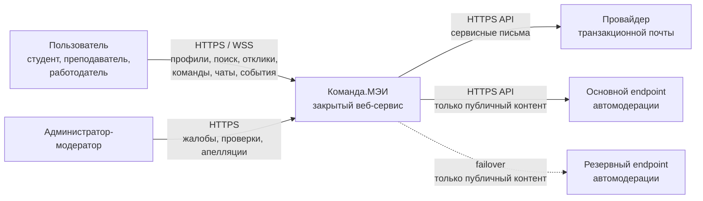
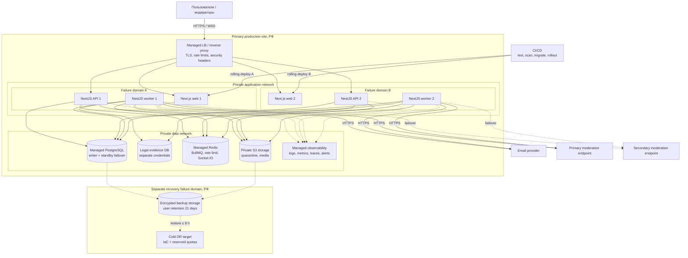
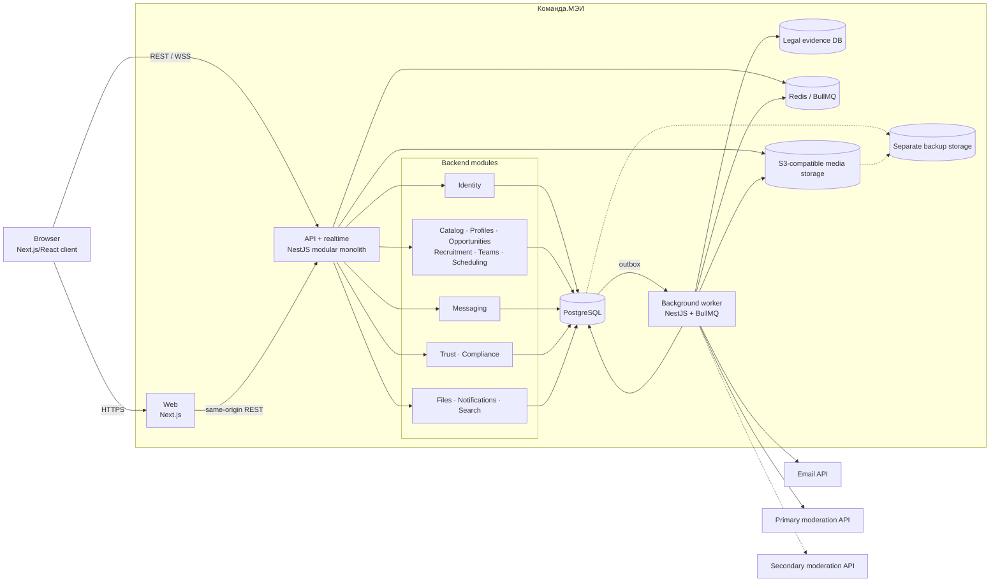

# Архитектура системы «Команда.МЭИ» — MVP

Статус: целевой system design MVP.
Дата: 19.08.2026.

## 0. Резюме и границы

Система строится как **модульный монолит**: один backend-кодовый базис, один основной PostgreSQL-кластер, отдельные процессы API и background worker, Redis/BullMQ для надёжного выполнения фоновых задач и S3-совместимое объектное хранилище. Frontend — адаптивное Next.js-приложение. Все production-хранилища персональных данных и резервные копии размещаются на территории РФ.

Архитектура рассчитана на целевой профиль MVP: до 10 000 аккаунтов, 2 000 MAU, 200 одновременно работающих пользователей и 30 RPS. Микросервисы, отдельный поисковый кластер, Kafka, Kubernetes, service mesh, event sourcing и multi-region active-active в MVP не используются.

Источники требований:

- `docs/product/product-spec.md` — функциональные требования и продуктовые NFR;
- `docs/product/requirements.md` — технические NFR;
- `C:/Users/alex/Downloads/CODEX_ARCHITECTURE_SPEC.md` — архитектурный baseline с более низким приоритетом.

Ключевые решения зафиксированы в принятых ADR из `docs/adr`: frontend, database, authentication, background processing, content moderation, disaster recovery, media/evidence и API compatibility. Настоящий документ остаётся сводным представлением системы; при изменении отдельного решения сначала актуализируется соответствующий ADR.

## 1. System context

«Команда.МЭИ» — закрытый для гостей веб-сервис. Пользователи создают профили и резюме, ищут людей и объявления, откликаются, общаются, создают команды и события. Модераторы работают через административную область того же приложения. Снаружи система зависит от сервиса транзакционной почты и двух независимо эксплуатируемых endpoints автомодерации — основного и резервного. Интеграций с SSO МЭИ, календарями и рекламными рассылками в MVP нет.



### Решение 1 — системная граница

| Decision | Alternatives | Trade-offs | Reason |
|---|---|---|---|
| Единый продуктовый контур; email и два одобренных endpoint автомодерации — единственные внешние runtime-зависимости | Один endpoint автомодерации; SSO МЭИ; внешние календари; несколько каналов уведомлений | Резервная автомодерация повышает стоимость интеграции и юридической проверки; зато отказ одного поставщика не останавливает публикацию | Публикация требует обязательной автомодерации, поэтому эта зависимость критичнее остальных интеграций |

## 2. Основные компоненты

Backend разделён на bounded contexts внутри одного процесса и репозитория. Модуль владеет своими таблицами и публикует только application services, query contracts и доменные события; ORM-модели и прямые SQL-запросы между модулями запрещены.

| Модуль | Ответственность и принадлежащие данные |
|---|---|
| `Identity` | аккаунты, credentials, подтверждение почты, sessions, согласия, системная роль модератора, жизненный цикл аккаунта |
| `Catalog` | утверждённый справочник из 180 канонических тегов и его product-managed версии |
| `Profiles` | профиль, основное и дополнительные резюме, проекты, теги резюме, дневная активность |
| `Opportunities` | личные и командные объявления, версии контента, просмотры, статусы публикации |
| `Recruitment` | отклики, неизменяемые снимки резюме, решения и правила повторного отклика |
| `Teams` | команды, единственный лидер, участники, заявки, приглашения, подписки, командный blacklist |
| `Scheduling` | события команд и представление календаря подписчика |
| `Messaging` | личные и командные conversations, current messages, immutable reported revisions до удаления, read state и скрытие чата |
| `Trust` | автомодерация, ручные проверки, жалобы, `ReportEvidence` references/access grants, решения, апелляции, личный blacklist и interaction policy |
| `Notifications` | внутренние уведомления и email deliveries |
| `Files` | metadata, upload sessions, карантин, обработка, привязка и удаление объектов |
| `Search` | денормализованная read model для поиска людей и объявлений и расчёт сортировок |
| `Compliance` | audit trail до удаления, задания на выгрузку/удаление и запись минимальных юридических доказательств |

`Catalog` остаётся небольшим read-only модулем монолита, а не самостоятельным сервисом; остальные модули хранят только ссылки на его tag IDs и используют публичный contract. Общий код ограничивается техническими primitives: идентификаторы запроса, транзакции, время, ошибки, outbox и telemetry. Универсальные repository/service abstractions не вводятся.

### Решение 2 — модульный монолит

| Decision | Alternatives | Trade-offs | Reason |
|---|---|---|---|
| Один deployable backend с явными границами модулей | Микросервисы; неструктурированный монолит | Нельзя независимо масштабировать предметные области; границы приходится проверять архитектурными тестами. Зато просты транзакции, локальная разработка и выпуск | Нагрузка мала, домены тесно связаны, команда и модель будут уточняться |

## 3. Frontend architecture

- Next.js, React и TypeScript strict; один responsive web client для desktop и mobile.
- App Router отвечает за маршруты, layout, server-rendered shell и code splitting. Основная закрытая часть приложения интерактивна на клиенте; SSR не используется как отдельный backend и не содержит бизнес-правил.
- Структура по пользовательским возможностям: `auth`, `profiles`, `search`, `opportunities`, `applications`, `teams`, `calendar`, `messaging`, `moderation`, `settings`. Общие UI-компоненты отделены от feature-кода.
- TanStack Query хранит server state и выполняет invalidation/refetch; React Hook Form и Zod применяются для форм; Tailwind CSS и shadcn/ui — для UI. Redux и собственный глобальный data store не нужны.
- REST является источником истины. Socket.IO-события только сигнализируют о новом сообщении/уведомлении и инвалидируют query cache; после reconnect клиент синхронизируется через REST.
- UI локализован на русском, поддерживает viewport от 360 px, клавиатурную навигацию, видимый focus, семантическую разметку и базовые ARIA-атрибуты.
- Клиентские проверки улучшают UX, но аутентификация, авторизация и все инварианты повторно проверяются backend.

### Решение 3 — один web client без BFF и глобального store

| Decision | Alternatives | Trade-offs | Reason |
|---|---|---|---|
| Next.js напрямую обращается к versioned REST API через same-origin reverse proxy | Отдельный BFF; GraphQL; Redux | Frontend зависит от API response models; сложные экраны требуют нескольких агрегирующих endpoints. Зато отсутствуют второй backend-слой и дублирование состояния | В MVP один клиент, закрытый контент не нуждается в сложной SEO-архитектуре, REST покрывает сценарии |

## 4. Backend architecture

Backend реализуется на NestJS/TypeScript как два process entrypoint из одного артефакта:

- `api` — stateless REST API и Socket.IO gateway;
- `worker` — outbox dispatch, BullMQ consumers и плановые задания.

Внутри модуля используется короткий поток `controller -> application service -> domain rules / Prisma`. Отдельные domain objects вводятся только для переходов состояний и сложных инвариантов; простой CRUD не оборачивается в искусственные слои. Zod является единственным основным механизмом runtime-валидации входных DTO. OpenAPI генерируется из публичных контрактов, а response DTO не являются Prisma-моделями.

Синхронный вызов другого модуля допустим только через его публичный application/query contract. Когда межмодульный инвариант обязан быть строгим — например, одновременная блокировка пользователя и отправка ему отклика, заявки или сообщения — application orchestrator открывает одну PostgreSQL-транзакцию и блокирует нормализованный interaction key `(scope, min(subjectA, subjectB), max(subjectA, subjectB))`. При нескольких ключах они берутся в лексикографическом порядке. SQLSTATE `40P01` и `40001` повторяются не более двух раз с jitter под тем же `Idempotency-Key`; после исчерпания попыток клиент получает безопасный retryable conflict. Затем orchestrator вызывает публичные команды модулей с общим transaction context; чужие repositories и SQL при этом не раскрываются. Протокол проверяется конкурентными integration tests. Побочные эффекты оформляются доменным событием в transactional outbox. Критическая операция не должна зависеть от доступности email, автомодерации или WebSocket.

### Решение 4 — NestJS, REST и pragmatic layering

| Decision | Alternatives | Trade-offs | Reason |
|---|---|---|---|
| NestJS modular monolith, REST/OpenAPI, Zod, Prisma; без общего CQRS-framework | Spring/.NET; GraphQL; полный Clean Architecture/CQRS | NestJS decorators и Prisma связывают infrastructure-код с framework; REST требует проектировать агрегирующие endpoints. Зато весь стек TypeScript, невысок порог входа и минимум шаблонного кода | Соответствует baseline и принципу boring technology; требования не оправдывают более сложные стили |

## 5. Data storage

Основное хранилище — один managed PostgreSQL-кластер в РФ с одним writer и standby/автоматическим failover. Это один логический database boundary, а не read-scaling architecture. Каждый модуль владеет отдельной PostgreSQL schema. Межмодульные foreign key допустимы только на стабильные идентификаторы, но прямое чтение чужих таблиц из кода запрещено.

Основные приёмы:

- UUIDv7 как идентификаторы, `timestamptz` в UTC, IANA timezone для события/профиля;
- CHECK, UNIQUE и foreign key constraints для инвариантов; row locks или compare-and-set для конкурентных решений;
- cursor pagination для messages, notifications и audit; явные составные индексы под access paths;
- immutable JSONB snapshot резюме с версией схемы; JSONB не заменяет нормализованную предметную модель;
- `pg_trgm`, PostgreSQL full-text search и GIN/B-tree indexes для `Search` read model;
- ежедневные activity buckets и уникальные view/application facts вместо пересчёта сырых событий за 30 дней;
- только инкрементальное обновление 30-дневных агрегатов; полный rebuild выполняется вручную вне пика и ограниченными batch;
- отдельные connection pool limits для API и workers, bounded worker concurrency, `statement_timeout` и `lock_timeout` для фоновых запросов;
- без шардирования и партиционирования до подтверждения измерениями.

Минимальные юридические доказательства согласий и уничтожения хранятся без профиля и контента в отдельной PostgreSQL database с отдельными credentials и трёхлетним retention. Из основного приложения доступна только append/read-by-authorized-compliance операция; внешних FK нет.

### Решение 5 — PostgreSQL как единственная бизнес-БД и поисковый движок MVP

| Decision | Alternatives | Trade-offs | Reason |
|---|---|---|---|
| Один PostgreSQL для OLTP, outbox и поисковой read model | Elasticsearch/OpenSearch; отдельная БД на модуль; document DB | Поиск менее гибок, а общий кластер остаётся общей точкой отказа. Зато транзакционные гарантии сильнее, backup/restore проще, а 30 RPS легко покрываются индексами | Требуется поиск только по ФИО/названию и фильтрам; отдельный кластер преждевременен |

## 6. Authentication/authorization

MVP использует локальную email/password-аутентификацию в `Identity`:

- пароль хэшируется Argon2id с версионируемыми параметрами;
- сервер выдаёт случайную opaque session ID в `Secure`, `HttpOnly`, `SameSite=Lax` cookie; в PostgreSQL хранится только хэш session ID, срок и состояние отзыва;
- unsafe-запросы защищаются проверкой `Origin` и CSRF token; login, registration, reset и resend ограничиваются по IP и account key;
- verification/reset tokens одноразовые, короткоживущие и хранятся только в виде хэша;
- неподтверждённый и удаляемый аккаунты имеют явные server-side state guards.

Socket.IO handshake принимает только allowlisted same-origin `Origin`, проверяет актуальную opaque session и состояние аккаунта. Каждая подписка на user/conversation room повторно проверяет object-level permission. Logout, revoke или переход аккаунта в ограниченное состояние разрывает активные sockets. Cross-origin handshake, подписка на чужую room и reconnect с отозванной session покрываются integration tests; Redis adapter используется только для fan-out, а не для авторизации.

Авторизация сочетает:

- RBAC для `user` и `moderator`; эскалация FR-159 задаётся отдельным permission `moderation.escalated_review`, а не глобальной ролью `administrator`;
- формальную роль профиля `student`/`teacher`/`employer` как бизнес-атрибут, а не системное право;
- resource ownership и relationship checks: author, team leader, conversation party, report assignee;
- deny-by-default policy на application-service boundary и повторную фильтрацию результатов чтения.

Минимальные moderation permissions: `reports.review`, `appeals.review`, `evidence.view`, `moderation.escalated_review`. Управление назначением этих прав отделено от просмотра evidence, а каждое использование `evidence.view` аудируется.

### Решение 6 — server-side opaque sessions вместо JWT/Keycloak

| Decision | Alternatives | Trade-offs | Reason |
|---|---|---|---|
| Локальные credentials и отзываемые PostgreSQL sessions | Self-contained JWT; Keycloak/OIDC | Свой auth требует security review и поддержки flows; запрос выполняет session lookup. Зато logout/revocation немедленны, нет отдельной identity-платформы и сложной миграции ролей | Один first-party web client и 30 RPS не оправдывают Keycloak; вариант явно разрешён baseline |

## 7. External integrations

Внешние runtime-интеграции:

1. Транзакционная почта: verification, reset, отклики, сообщения, команды, события, модерация. Отправляется worker через HTTPS API; marketing email отсутствует.
2. Основной и резервный endpoints автомодерации публичного текста и изображений. Они должны принадлежать независимо отказоустойчивым контурам и оба пройти юридическую/security-проверку обработки данных в РФ. Worker передаёт только минимально необходимый публичный контент. Запрос содержит версию политики, а ответ нормализуется в стабильные violation codes из `appendix-prohibited-content.md`; решение, причина и версия политики доступны для аудита и обжалования.

Интеграции имеют по одному узкому port (`EmailSender`, `ContentModerator`) и явные adapters. `ContentModerator` сначала использует основной endpoint; timeout, transport error или открытый circuit breaker переключают конкретную job на резервный. `ModerationRequest` хранит generation и active endpoint: только результат активной generation может атомарно завершить request, а запоздалый ответ предыдущего endpoint игнорируется и учитывается в telemetry. Повтор одного moderation request использует стабильный provider idempotency key. Если оба endpoints недоступны, версия остаётся `pending`, пользователь видит задержку, а автоматического или ручного одобрения не происходит: FR-132 требует завершённой автомодерации. `moderation_pending_age` предупреждает дежурного через 5 минут и открывает critical incident через 30 минут. Ручная очередь может приоритизировать и исследовать объект, но не заменяет обязательный автоматический gate.

До production для обоих endpoints фиксируются SLA, connect/total timeouts, rate limits, правила удаления переданных данных и проверенный failover test. Это оправданная граница нестабильности, а не общий abstraction framework.

### Решение 7 — асинхронные provider adapters

| Decision | Alternatives | Trade-offs | Reason |
|---|---|---|---|
| Вызывать email и primary/secondary moderation только из worker через узкие adapters | Один moderation endpoint; вызов в request transaction; собственные SMTP/ML-системы | Второй endpoint увеличивает стоимость договора, тестирования и privacy review; зато отказ одного поставщика не останавливает обязательный publication gate | NFR разрешают eventual consistency, но автомодерация обязательна для каждой публичной версии |

## 8. Background processing

PostgreSQL outbox фиксируется в одной транзакции с предметным изменением. Для каждого заинтересованного consumer создаётся delivery record. Dispatcher блокирует пакет незавершённых deliveries через `FOR UPDATE SKIP LOCKED` и публикует BullMQ job с `(eventId, consumer)` как `jobId`. Consumer записывает `eventId` в свой inbox/processed table в одной транзакции со своим эффектом, после чего delivery отмечается завершённым. Reconciliation job повторно публикует незавершённые deliveries, поэтому потеря содержимого Redis не делает outbox-событие потерянным.

Очереди разделяются только по разным профилям retry/ресурсам:

- `critical-domain` — создание контекстного чата и каскадные workflows;
- `notifications` — внутренние уведомления и email;
- `media-private` — техническая обработка вложений Messaging без маршрута к `ContentModerator`;
- `media-public` — техническая обработка публичных изображений и выпуск события `PublicMediaTechnicallyReady`;
- `moderation` — только публичный контент, primary/secondary failover и ручные SLA/escalation;
- `search` — обновление read model и 30-дневных агрегатов;
- `maintenance` — снятие неактивных объявлений, удаление аккаунтов/команд, retention и exports.

Плановые задачи создаются BullMQ scheduler с детерминированным job key. Worker масштабируется независимо, но использует тот же код и release artifact, что API.

### Решение 8 — outbox + BullMQ, без event broker

| Decision | Alternatives | Trade-offs | Reason |
|---|---|---|---|
| PostgreSQL transactional outbox и Redis/BullMQ workers | Только cron/DB polling; Kafka/RabbitMQ; синхронные side effects | Два инфраструктурных хранилища и at-least-once semantics требуют дедупликации; зато получаем управляемые retries, задержанные задачи и горизонтальных workers без Kafka | NFR требуют устойчивой очереди и надёжных побочных эффектов, а объём мал для streaming platform |

## 9. Caching

Предметный server-side cache в MVP отсутствует. PostgreSQL с индексами остаётся источником каждого бизнес-чтения. TanStack Query кэширует данные в браузере; tag catalog и другие редко меняющиеся справочники используют HTTP `ETag`/`Cache-Control: private`.

Redis используется для BullMQ, distributed rate limits и Socket.IO adapter при нескольких API-инстансах, но не как источник истины и не как обязательный cache бизнес-объектов. Кэш добавляется только после измерения конкретного hot query с зафиксированной стратегией invalidation.

### Решение 9 — cache on evidence

| Decision | Alternatives | Trade-offs | Reason |
|---|---|---|---|
| Не вводить shared domain cache до измерений | Redis cache-aside; CDN для закрытых API | Больше чтений PostgreSQL; зато нет stale authorization/data и сложной invalidation | 30 RPS и 85:15 покрываются БД; безопасность важнее гипотетической экономии миллисекунд |

## 10. File/object storage

S3-совместимое managed storage в РФ хранит media, а PostgreSQL — metadata и связи. Объекты приватны, имена случайны и не содержат PII.

Каждая upload session получает неизменяемый `contentScope: private_message | public_content` и owner reference. `Messaging` может создавать только `private_message`; публичные модули — только `public_content`. Runtime guard в `ContentModerator` отклоняет любой scope, кроме `public_content`, а dependency test запрещает импорт moderation adapter из `Messaging`.

Upload — двухфазный:

1. API создаёт короткоживущую upload session и presigned PUT в `quarantine`.
2. После загрузки клиент завершает session; `media` worker проверяет размер, magic bytes/MIME, декодирование, malware, удаляет EXIF, уменьшает до Full HD/1 МБ и переносит результат в private `media`.
3. После sanitization объект получает `technically_ready` и переносится в private `media`. Приватное вложение на этом завершает обработку: клиент получает `ready`, а сообщение создаётся одной транзакцией только для готовых attachments.
4. Публичное изображение переходит в `moderation_pending`. Провайдер получает short-lived scoped GET URL только на один sanitized object, без bucket credentials и list/write permissions. После `approved` версия может быть опубликована; при `rejected` или `moderation_failed` она остаётся скрытой.

Полный state machine публичного изображения: `uploaded -> quarantined -> sanitized -> technically_ready -> moderation_pending -> approved | rejected | moderation_failed -> attached_to_published_version`. Провайдер никогда не получает объект прямо из quarantine. Невозможность скачать объект считается ошибкой moderation job, а не одобрением.

Выдача выполняется короткоживущим signed GET только после проверки прав API. Для аватаров, объявлений и событий возможно CDN/proxy позже, но источник остаётся private.

При создании жалобы `Messaging` атомарно фиксирует immutable revision текущего текста только для оспариваемого сообщения; обычные редактирования без жалобы не создают историю. `Trust` хранит `ReportEvidence` как ссылку на этот `messageRevisionId` и соответствующие `attachmentId`, а не копию текста или media в audit. Модератор с `evidence.view` получает содержимое только из экрана конкретной открытой жалобы; API повторно проверяет назначение жалобы и выдаёт одноразовый short-lived URL для attachment. Audit содержит только actor, report, evidence IDs, время и результат доступа. Если исходное сообщение физически удалено, его reported revisions/attachments также удаляются, evidence помечается `unavailable`, а решение принимается по оставшимся metadata; восстанавливать содержимое из backup для модерации запрещено.

Отдельный snapshot evidence после удаления сообщения в MVP не создаётся: это конфликтовало бы с FR-124 без явного основания и retention. Если product/legal review потребует сохранять такой snapshot, сначала изменяются продуктовая спецификация, политика обработки и сроки удаления, затем ADR-007.

Удаление объекта оформляется tombstone и idempotent job. Для 501-й фотографии чата транзакция резервирует новое вложение и помечает самые старые attachments отправителя на удаление только после успешной обработки нового. Quarantine имеет lifecycle не более 24 часов. Backup retention основного контура — не более 21 дня, чтобы данные, существовавшие до необратимого удаления на 7-й день, гарантированно исчезли до 30-го дня от исходного запроса.

### Решение 10 — private S3 с quarantine workflow

| Decision | Alternatives | Trade-offs | Reason |
|---|---|---|---|
| Direct upload по presigned URL, карантин и асинхронная обработка | Файлы в PostgreSQL; upload через API; публичный bucket | Workflow сложнее простого upload и требует временных состояний; зато API не передаёт большие тела, опасный файл не доставляется, а масштабирование stateless | Выполняет лимиты, EXIF/безопасность и p95 обработки до 5 секунд |

## 11. Communication protocols

| Связь | Протокол и контракт |
|---|---|
| Browser ↔ web/API | HTTPS, same origin; REST JSON `/api/v1`; OpenAPI; ISO 8601; UTF-8 |
| Realtime | Socket.IO поверх WSS; same-origin handshake, opaque session auth, room-level authorization; только hints/events с `eventId`, без статуса source-of-truth |
| Upload/download | HTTPS presigned S3 URL; private objects |
| API/worker ↔ PostgreSQL | PostgreSQL wire protocol с TLS внутри private network |
| API/worker ↔ Redis | RESP с TLS/auth внутри private network |
| Worker ↔ providers | HTTPS API с connect/read timeout и request correlation ID |

Ошибки REST имеют стабильные machine-readable `code`, русское `message`, `requestId`, допустимые `details` и подходящий HTTP status. Большие списки используют cursor pagination. gRPC, GraphQL и публичные webhooks не вводятся.

Внутри `/api/v1` изменения additive-only: существующие поля не удаляются, не переименовываются и не становятся более строгими в том же rolling-deploy window. Удаление проходит через deprecation и новую major API version. CI сравнивает OpenAPI с последней выпущенной спецификацией, блокирует breaking changes и компилирует generated client; contract tests проверяют совместимость старого клиента с новым API и нового клиента со старым API.

### Решение 11 — REST + WSS hints

| Decision | Alternatives | Trade-offs | Reason |
|---|---|---|---|
| Versioned REST как source of truth, Socket.IO для доставки событий | Только polling; GraphQL subscriptions; gRPC | Два клиентских канала и reconnect logic; зато сообщения доставляются в срок, а потерянное событие восстанавливается обычным REST refetch | Простая и широко поддерживаемая модель для web и realtime требований |

## 12. Failure handling

Применяется fail-safe поведение:

- ошибка до commit откатывает транзакцию и не показывает успех;
- ошибка после commit не отменяет предметное действие: outbox повторяет side effect;
- email: bounded retries с exponential backoff/jitter, затем dead-letter и alert;
- автомодерация: timeout/transport failure основного endpoint переключает job на резервный; при отказе обоих версия остаётся `pending`/скрытой, последняя одобренная версия продолжает показываться, срабатывают age-based alerts и пользователь видит задержку;
- media: attachment получает `failed`, объект карантина удаляется, сообщение с ним не создаётся;
- Redis: подтверждённые изменения и outbox сохраняются в PostgreSQL, доставка возобновляется после восстановления; auth endpoints fail closed, если недоступен распределённый rate limit;
- S3: новые media uploads недоступны, текстовые операции продолжаются; недоступный объект не заменяется «успешным» вложением;
- PostgreSQL: readiness снимает instance с балансировщика, изменяющие операции fail closed;
- Socket.IO: невалидный Origin/session или запрещённая room отклоняются; при разрыве клиент показывает reconnect state и восстанавливает данные через REST;
- background jobs имеют max attempts, dead-letter state, причину, метрики и безопасный manual replay.

Для каскадного удаления команды/аккаунта используется restartable workflow с checkpoint на шаге, а не одна долгая транзакция. Сначала объект скрывается и блокируются изменения, затем создаются уведомления, после чего очищаются зависимости и media. Каждый шаг идемпотентен.

### Решение 12 — partial degradation и durable retries

| Decision | Alternatives | Trade-offs | Reason |
|---|---|---|---|
| Критические записи fail closed; вторичные функции деградируют и повторяются | Общий fail-open; распределённая транзакция | Пользователь иногда видит pending/задержку; зато нет ложного успеха и внешние провайдеры не становятся общей точкой отказа | Соответствует TNFR-006 и error scenarios продукта |

## 13. Idempotency

`Idempotency-Key` обязателен для повторяемых command endpoints: создание отклика/сообщения/команды/жалобы, решения, membership actions, завершение upload и запрос удаления. Backend хранит `(actorId, route, key, requestHash, status, responseRef, expiresAt)` в PostgreSQL; тот же key с другим payload отклоняется. Запись создаётся и завершается в транзакции с командой.

Ключ не заменяет предметные ограничения:

- один активный/принятый отклик на business key с атомарной заменой;
- единственный context chat по `(opportunityId, candidateId, ownerPartyId)`;
- один participant/follower/block relation;
- одна открытая жалоба на `(reporterId, targetType, targetId)`;
- optimistic version/conditional update для необратимого решения;
- `eventId` для outbox/BullMQ/inbox и provider deduplication key, если провайдер его поддерживает.

### Решение 13 — два уровня дедупликации

| Decision | Alternatives | Trade-offs | Reason |
|---|---|---|---|
| Idempotency record на API boundary плюс UNIQUE/state constraints в домене | Только client key; только проверки в коде | Нужны дополнительная таблица и очистка TTL; зато повтор сети и конкурентный запрос не создают дубль | NFR-006 прямо требует отсутствие дублей и атомарные переходы |

## 14. Consistency model

Модель — **strong consistency для инвариантов, eventual consistency для проекций и side effects**.

В одной PostgreSQL-транзакции выполняются: создание/замена отклика, необратимое решение, membership transition, блокировка и её влияние на активную заявку/приглашение, создание message после готовности файлов, запись consent, скрытие при deletion request и outbox event. Межмодульные interaction commands сериализуются общим lock и вызывают только публичные module contracts.

Асинхронно и с контролируемой задержкой выполняются: email, internal notification, context chat после принятия, search projection, moderation, media processing, метрики и физическое удаление. Принятый отклик остаётся принят даже при сбое чата; уникальный handler и safe retry создают ровно один чат. Публичная видимость новой версии меняется только после успешной модерации.

Целевые окна: внутреннее уведомление ≤10 с p95, email ≤5 мин p95, message delivery ≤3 с, media processing ≤5 с, search projection — operational target ≤10 с p95. Последнее является архитектурным budget, а не новым продуктовым SLA.

### Решение 14 — локальные ACID-транзакции и eventual side effects

| Decision | Alternatives | Trade-offs | Reason |
|---|---|---|---|
| Strong consistency внутри invariant boundary, outbox между модулями | Eventual consistency для всего; distributed transactions | Некоторое время UI показывает pending, нужны reconciliation jobs; зато критические состояния атомарны без 2PC | Точно повторяет TNFR-006 и допускаемый продуктом частичный сбой чата/уведомления |

## 15. Scalability

Стартовая production-конфигурация: по 2 web/API replicas в разных failure domains и 1–2 worker replicas за балансировщиком, managed PostgreSQL с standby/автоматическим failover и connection pool, persistent managed Redis с failover и S3. API stateless: sessions, jobs и media не находятся в памяти процесса. Sticky sessions не нужны; Socket.IO при нескольких API-инстансах использует Redis adapter.

Путь роста без смены публичных контрактов:

1. измерить slow queries, добавить/исправить индексы и устранить N+1;
2. вертикально масштабировать PostgreSQL и настроить pool limits;
3. независимо увеличить API/worker replicas и concurrency очередей;
4. добавить кэш конкретного доказанного hot read;
5. рассматривать read replica, если после query/index tuning DB CPU или read latency превышают 70% согласованного capacity budget в течение 15 минут либо p95 чтения нарушается в двух последовательных load tests;
6. только затем рассматривать partitioning messages/audit/outbox или отдельный search engine;
7. выделять модуль в сервис только при независимом профиле нагрузки/команде и измеряемом операционном выигрыше.

До первого production-запуска обязателен mixed load/soak test профиля TNFR-001/002: 30 RPS, из них 5 write RPS, 200 Socket.IO connections, поиск, сообщения, media processing и background queues. Тот же тест повторяется перед изменениями хранения/индексов. Проходными являются TNFR p50/p95/p99, отсутствие неограниченного роста outbox/queues и запас не менее 30% по DB CPU/connections и worker capacity.

### Решение 15 — scale the monolith first

| Decision | Alternatives | Trade-offs | Reason |
|---|---|---|---|
| Горизонтальные stateless instances и вертикальный рост managed data services | Шардинг; микросервисы; autoscaling Kubernetes | Масштабирование модулей API не независимо, PostgreSQL остаётся bottleneck; зато конфигурация многократно превосходит целевые 30 RPS при низкой эксплуатационной цене | TNFR-005 прямо указывает такой путь роста MVP |

## 16. Security boundaries

```text
Internet
  -> public TLS load balancer / reverse proxy
      -> private application network: web, API, worker
          -> private data network: PostgreSQL, Redis, S3 private endpoints
          -> controlled egress: email and moderation providers
```

- Только reverse proxy имеет публичный inbound; PostgreSQL, Redis, worker и S3 buckets недоступны из Internet.
- API — единственная граница доступа к бизнес-данным и signed URLs. Worker использует отдельную service identity с минимальными правами на очереди/buckets.
- Moderator UI не является доверенной зоной: каждое действие авторизуется server-side и пишется в audit.
- Приватные messages и attachments не имеют пути к `ContentModerator`: их `contentScope` проверяется при создании job и повторно в provider adapter. Только публичный sanitized object может получить provider-scoped URL.
- Доступ к evidence разрешён только назначенному модератору из контекста открытой жалобы и permission `evidence.view`; содержимое не копируется в audit/logs/traces, а каждый просмотр фиксируется только metadata.
- Secrets находятся в secret store/CI protected variables, регулярно ротируются и не попадают в image/logs.
- TLS везде, encryption at rest у managed PostgreSQL/Redis/S3/backups, security headers, CSP, dependency/container scanning.
- Logs/traces не содержат пароли, tokens, message text, media, email или полный resume; user IDs псевдонимизируются для telemetry.
- Signed URLs короткоживущие и выдаются после object-level authorization; upload policy ограничивает размер и content type, но не заменяет server-side inspection.
- Legal evidence отделены credentials и role grants от основного пользовательского контура.

### Решение 16 — three-zone boundary и least privilege

| Decision | Alternatives | Trade-offs | Reason |
|---|---|---|---|
| Public edge, private app zone, private data zone; отдельный legal access scope | Плоская сеть; отдельный account/VPC на каждый модуль | Сетевые правила и service identities требуют сопровождения; зато компрометация web/API не даёт прямого публичного доступа к данным, а юридические записи изолированы | Требуется защита ПДн, переписки, moderation data и минимизация прав |

## 17. Observability

Все процессы пишут структурированные JSON logs с `requestId`, `correlationId`, `eventId`, module, operation, result и latency без содержимого ПДн. OpenTelemetry instrumentation связывает HTTP, Prisma, outbox и job execution; errors отправляются в Sentry либо эквивалент, metrics — в managed Prometheus/Grafana либо эквивалентный российский сервис.

Обязательные метрики и alerts:

- RPS, error ratio, availability и p50/p95/p99 по классу endpoint;
- DB pool saturation, slow queries, locks, storage и backup age/result;
- queue depth/oldest age/retry/DLQ, outbox lag и worker duration;
- media p95, moderation backlog/deadline risk, primary/secondary provider availability, circuit-breaker state и `moderation_pending_age`;
- PostgreSQL wait events, lock/deadlock rate, statement timeouts и раздельная saturation API/worker pools;
- S3 usage и число chat photos на пользователя;
- deletion/export workflow age и приближение 30-дневного срока;
- alert на критический сбой не позднее 15 минут.

Readiness проверяет необходимые зависимости для обслуживания трафика; liveness — только зависание процесса, чтобы временный сбой PostgreSQL не вызвал restart storm. Audit trail — бизнес-данные `Compliance`, а не operational logs. SLO dashboards соответствуют TNFR-003/004/012.

### Решение 17 — единая correlation chain и SLO-first telemetry

| Decision | Alternatives | Trade-offs | Reason |
|---|---|---|---|
| Structured logs + metrics + traces вокруг journeys и очередей | Только текстовые logs; собственная observability platform | Есть стоимость telemetry backend и discipline инструментирования; зато можно доказать p95/p99, найти потерянный side effect и контролировать сроки удаления/модерации | Это минимальный набор для измеряемых NFR и безопасного manual replay |

## 18. Deployment architecture

Production размещается у провайдера в РФ без Kubernetes. Docker images версионируются immutable digest. Reverse proxy/load balancer завершает TLS и направляет `/` в Next.js, `/api` в NestJS и `/socket.io` в realtime gateway. Web/API/worker могут использовать один release, но запускаются отдельными process roles. Вторая площадка в РФ является cold DR target: production-трафик в штатном режиме не принимает, но имеет проверенные IaC, доступ к отдельному backup failure domain, зарезервированные quotas и runbook восстановления.



CI/CD выполняет lint, unit/integration/API/E2E tests, dependency/image scan, build, миграции и rolling deploy. Миграции следуют expand/migrate/contract; destructive contract выполняется отдельным поздним release. Перед rollout проверяется backup и совместимость rollback. При дефекте трафик возвращается на предыдущий image не более чем за 30 минут без отката уже применённых данных.

Ежедневные encrypted backups PostgreSQL, legal evidence DB и object inventory/copy хранятся в отдельном failure domain в РФ не более 21 дня для пользовательского контура; legal evidence использует свой обоснованный retention. Обычный отказ instance/host закрывается managed failover с внутренней целью ≤15 минут и не использует DR restore. Потеря основной площадки или невосстановимая порча данных закрывается cold DR: RPO ≤24 ч, RTO ≤8 ч. Restore rehearsal проводится ежеквартально именно в DR target и включает приложение, secrets rotation, PostgreSQL, legal evidence DB, media, Redis/BullMQ recovery и проверку DNS/TLS. Наличие DR target не означает active-active между площадками.

### Решение 18 — Docker и managed stateful services без Kubernetes

| Decision | Alternatives | Trade-offs | Reason |
|---|---|---|---|
| Rolling Docker deployment в двух local failure domains плюс cold DR target в РФ; managed PostgreSQL/Redis/S3 | Kubernetes; один VPS со всем стеком; multi-region active-active | Cold DR требует регулярных restore exercises и зарезервированных quotas, но дешевле постоянно активной второй площадки. Local failover поддерживает 99,5%, а cold DR — требуемые RPO/RTO | Минимальная эксплуатационная сложность, при которой отказ основной площадки действительно восстанавливаем |

## 19. Container diagram



## 20. Major request flow: принятие отклика

Этот flow выбран как главный, потому что связывает авторизацию, необратимый state transition, outbox, идемпотентное создание чата и уведомления.

```mermaid
sequenceDiagram
    autonumber
    actor Author as Автор / лидер
    participant Web as Next.js client
    participant API as NestJS API
    participant Recruitment
    participant DB as PostgreSQL
    participant Worker as Outbox/BullMQ worker
    participant Messaging
    participant Notifications
    participant Email as Email provider
    participant Socket as Socket.IO

    Author->>Web: Принять отклик
    Web->>API: POST /api/v1/applications/{id}/accept<br/>Idempotency-Key, session cookie
    API->>Recruitment: authorize + accept(command)
    Recruitment->>DB: BEGIN; lock application
    Recruitment->>DB: conditional status pending -> accepted
    Recruitment->>DB: insert outbox ApplicationAccepted
    Recruitment->>DB: COMMIT
    Recruitment-->>API: accepted
    API-->>Web: 200 accepted, chatStatus=pending

    Worker->>DB: claim independent outbox deliveries
    par Create context chat
        Worker->>Messaging: ensureContextConversation(eventId)
        Messaging->>DB: INSERT conversation<br/>ON CONFLICT use existing
        Messaging->>DB: mark inbox event processed
    and Notify in app
        Worker->>Notifications: ensure in-app notification
        Notifications->>DB: INSERT notification ON CONFLICT
        Notifications->>Socket: notify eventId
    and Send email
        Worker->>Email: send with provider idempotency key
    end

    alt временный сбой создания чата
        Worker->>Worker: retry with backoff
        Web->>API: POST /applications/{id}/retry-chat
        API->>DB: verify accepted and enqueue same business key
    end

    Web->>API: GET /api/v1/applications/{id}/result
    API-->>Web: accepted + conversationId
```

## 21. Проверка покрытия требований

| Группа требований | Архитектурный механизм |
|---|---|
| FR-001—011, 152—155; TNFR-009 | Local auth, opaque sessions, consent records, email verification, server-side guards |
| FR-012—043 | Нормализованные Profiles/Opportunities, Search projection на PostgreSQL, дневные/30-дневные агрегаты |
| FR-044—084 | Версии контента, moderation gate, immutable resume snapshot, ACID state transitions, context-chat outbox |
| FR-085—114 | Teams/Scheduling ownership, unique membership constraints, transactional transitions, notification events |
| FR-115—130; NFR-005/009/016/020 | Messaging, authenticated same-origin WSS, private media scope без пути к moderation provider, sender quota и private S3 |
| FR-131—142, 156—159; NFR-024 | Primary/secondary automated gate, moderation queue, `ReportEvidence` reference access, deadline fields, priority escalation и audit metadata |
| FR-143—151, 160; TNFR-008/010/011 | Immediate hide, restartable deletion workflow, ≤21-day backups, isolated legal evidence |
| TNFR-001—005, 012—014 | Stateless replicas, indexed PostgreSQL, mixed load/soak gate, observability, rolling Docker deployment, responsive web |
| TNFR-006—007, 013 | ACID + outbox/inbox, canonical interaction locks, daily backups, cold-DR drills, API compatibility gate, expand/migrate/contract и rollback |

## 22. Обязательное продуктовое решение до расширения evidence retention

Текущая архитектура позволяет модератору просмотреть оспариваемое сообщение только пока исходный объект существует. После физического удаления чата evidence становится `unavailable`; backup не используется как moderation storage. Сохранение отдельного snapshot после удаления может улучшить рассмотрение жалобы, но меняет обещание физического удаления FR-124 и обработку персональных данных.

До реализации snapshot product owner и профильный юрист должны определить основание, точный срок, доступ, поведение при удалении аккаунта/чата и текст пользовательской политики. Решение оформляется изменением `product-spec.md` и ADR-007. До этого отдельные копии текста сообщений и media запрещены.

## 23. Явно отложенные решения

До появления измеряемой потребности не вводятся:

- Elasticsearch/OpenSearch, read replicas, partitioning и sharding;
- Keycloak/SSO МЭИ и социальные identity providers;
- отдельные Messaging/Search/Notifications services;
- CDN для приватных media;
- Kafka/RabbitMQ, Kubernetes, service mesh;
- recommendation engine, analytics warehouse, внешние календари и рекламные каналы.

Триггер пересмотра — не прогноз роста, а нарушение SLO после query/index/pool tuning, независимый профиль масштабирования, отдельная команда-владелец или обязательная новая интеграция.
